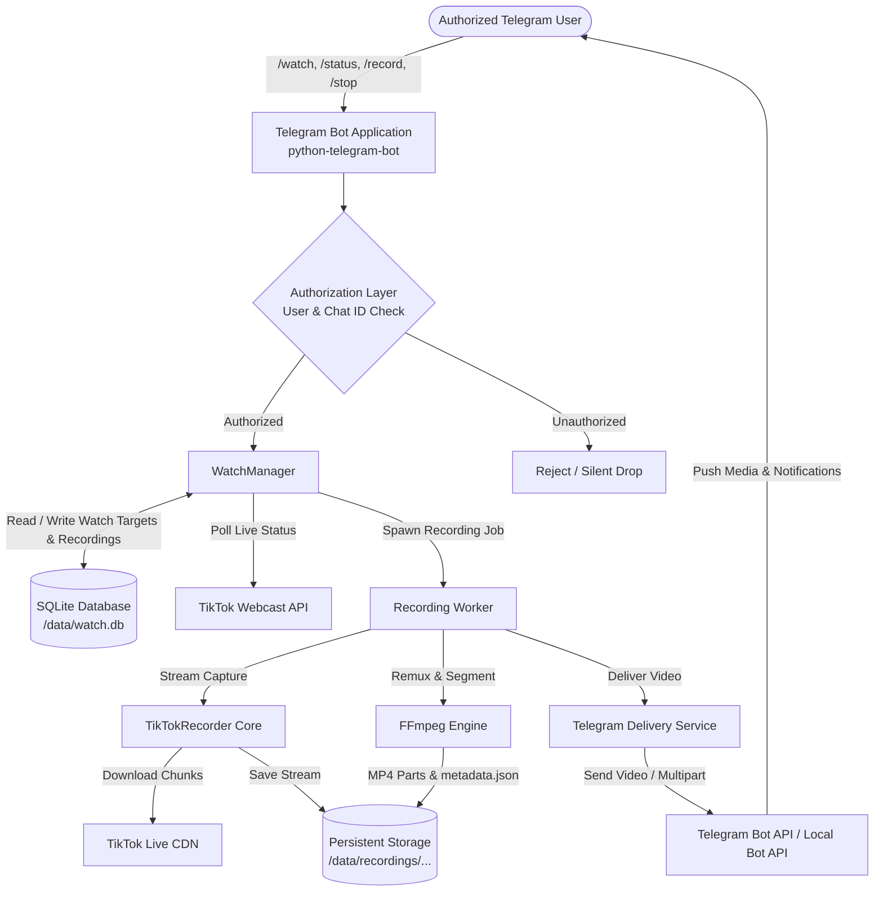
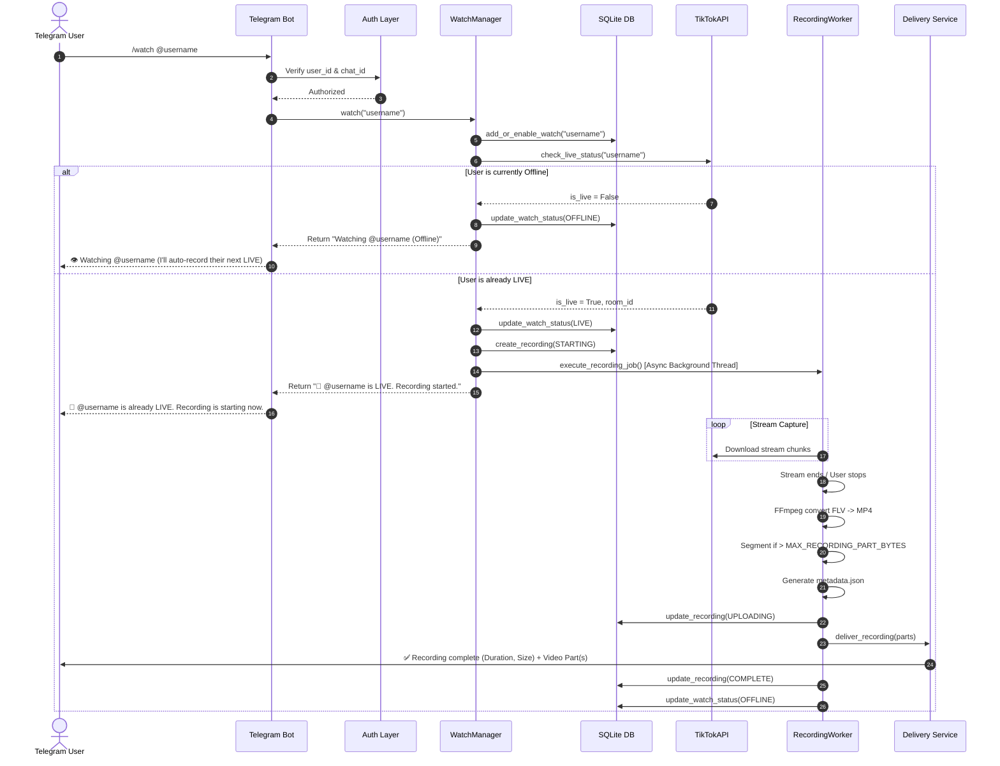
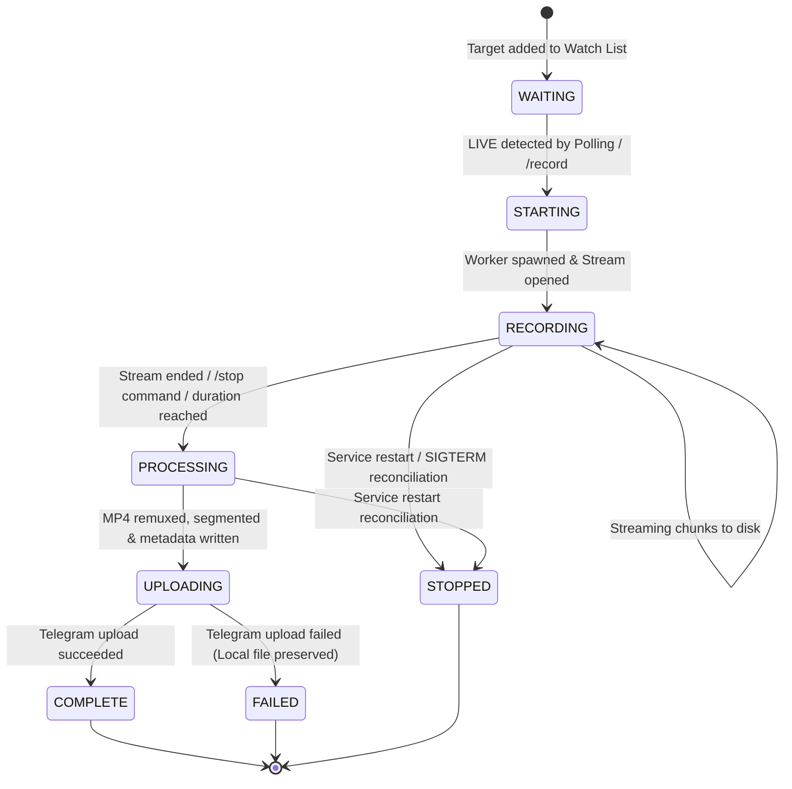
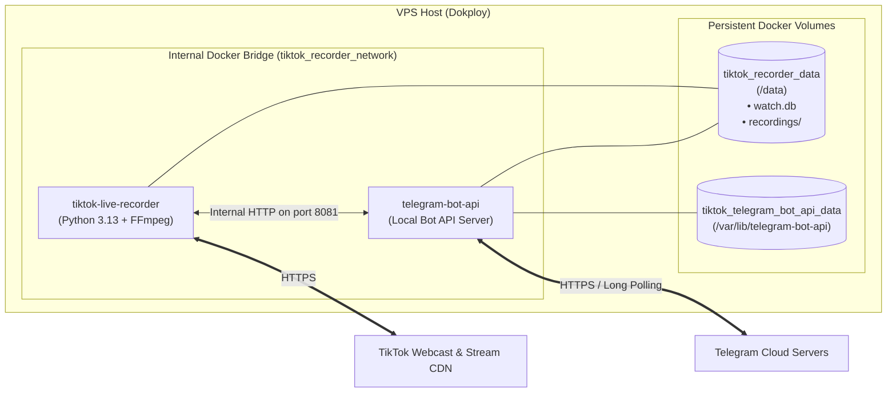

# System Architecture & Design

This document details the architecture, component interactions, sequence flows, and state machines for the TikTok Live Recorder Telegram Watch Service.

---

## 1. High-Level System Architecture



---

## 2. `/watch` Sequence Flow



---

## 3. Recording Lifecycle State Machine



---

## 4. Deployment Topology (Dokploy / Docker Compose)



---

## 5. Storage Partitioning Layout

Recordings are deterministically structured by creator and UTC date to prevent file collisions and keep directories manageable:

```text
/data/
├── watch.db                 # SQLite database file (WAL mode)
├── watch.db-wal
├── watch.db-shm
├── cookies.json             # Optional custom TikTok cookies
└── recordings/
    └── username/
        └── 2026/
            └── 08/
                └── 24/
                    └── username_2026-08-24_22-42-15/
                        ├── recording.mp4          # Final remuxed video (< 1.8 GB)
                        ├── metadata.json          # Recording metadata
                        ├── username_part_000.mp4   # If segmented (> 1.8 GB)
                        └── username_part_001.mp4
```
